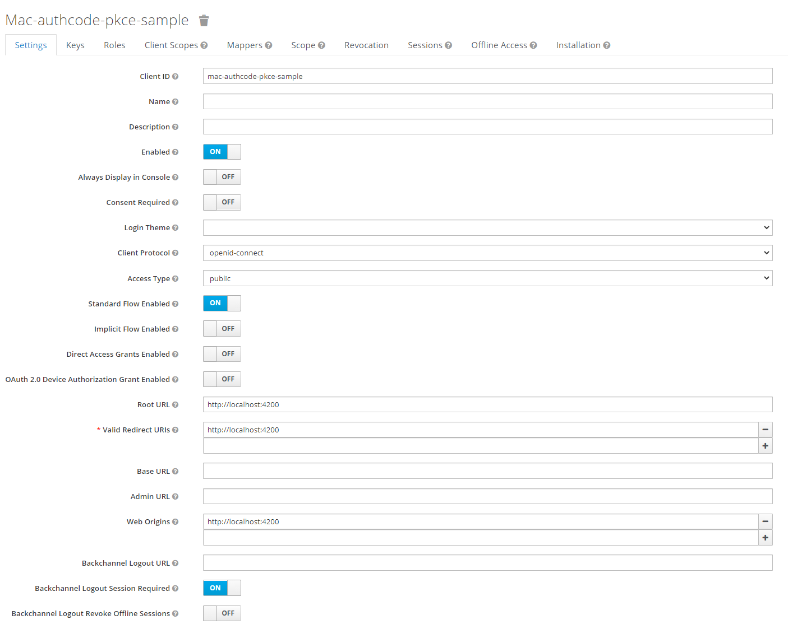

## mac-ng-keycloak-authcode

## Authorization Server
1. Start Keycloak
```
docker run -p 8080:8080 -e KEYCLOAK_USER=admin -e KEYCLOAK_PASSWORD=admin quay.io/keycloak/keycloak:15.0.0
```
2. Create a new Realm `mac-keycloak`
3. Create a new Client `mac-authcode-pkce-sample`
4. Configure Client as below
  
5. Create new user account


## Reference 
* https://ordina-jworks.github.io/security/2019/08/22/Securing-Web-Applications-With-Keycloak.html
* https://github.com/manfredsteyer/angular-oauth2-oidc
